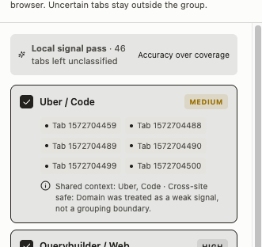

# Zen Tab

> A calm, fast workspace for your browser tabs.

Zen Tab is a Manifest V3 Chrome extension for people who work with many tabs. It keeps the browser organized without taking over: duplicate tabs are handled quickly, project groups are suggested with evidence, and sessions can be stashed and restored when you need them again.

## Preview




## Highlights

- **Live tab workspace** — Browse windows, native tab groups, and ungrouped tabs from Chrome's side panel.
- **Duplicate guard** — Detect repeated pages using conservative URL normalization. Actions are fast, reversible, and isolated between normal and private windows.
- **Project-aware grouping** — Suggests groups from titles, URL paths, search terms, and optional page context instead of grouping by domain alone.
- **Safe cleanup** — Recommends low-value tabs for review; nothing is closed until you confirm it.
- **Stash and restore** — Save a window, group, or selection locally, close the saved tabs, and restore them later in a new window.
- **Large-session friendly** — Uses event-driven state updates, incremental rendering, bounded AI batches, and no background polling.
- **Keyboard-friendly selection** — Supports multi-selection patterns such as Command/Ctrl-click, Shift-click, and Command/Ctrl+A.

## Privacy and safety

- Tab management works without an AI provider.
- Project analysis starts with tab metadata; page summaries are opt-in and requested only when additional context is needed.
- Local analysis is preferred when available. Groq is optional BYOK: your API key is stored locally and is used only after you choose Groq in Settings.
- AI grouping and cleanup always show a review state. Low-confidence tabs remain unclassified instead of being forced into a group.
- Cleanup uses conservative guardrails for active, pinned, local, audio-playing, and protected pages. If safety cannot be verified, the page is left alone.
- Stashes are stored in `chrome.storage.local`. Zen Tab does not collect full browsing history or enable telemetry by default.

## Install as an unpacked extension

### Requirements

- Chrome 116 or newer
- Node.js and npm for building from source

### Build

```bash
npm install
npm run build
```

### Load in Chrome

1. Open `chrome://extensions`.
2. Enable **Developer mode**.
3. Click **Load unpacked**.
4. Select this project's generated `dist/` directory.
5. Pin Zen Tab if you want quick access, then click its toolbar icon to open the side panel.

After source changes, run `npm run build` again and click **Reload** on the extension card.

## Development

Start the Vite development workflow:

```bash
npm run dev
```

Run the complete quality gate before submitting changes:

```bash
npm run check
```

The quality gate includes:

- TypeScript type checking
- Unit tests
- Production extension build

## Architecture

Zen Tab is built with:

- Manifest V3
- React + Vite + TypeScript
- Chrome `sidePanel`, `tabs`, `tabGroups`, and `storage` APIs
- A service worker as the source of truth for tab state and browser mutations
- Virtualized side-panel rendering for large tab collections
- A provider interface for local and optional cloud AI analysis

## Project status

Zen Tab is currently an active development project. The core side-panel workspace, duplicate handling, stash/restore flow, AI grouping preview, conservative cleanup flow, settings, localization, undo behavior, and performance-oriented state updates are implemented. Chrome Desktop is the supported target for now.

---

# Zen Tab（中文）

> 一个安静、快速的浏览器标签工作区。

Zen Tab 是一款面向重度标签用户的 Manifest V3 Chrome 扩展。它不会强行改变你的浏览习惯，而是在后台帮助你处理重复标签、整理项目上下文，并把暂时不用的工作会话保存下来，之后随时恢复。

## 产品预览


## 核心能力

- **实时标签工作区**：在 Chrome 侧边栏中查看多个窗口、原生标签组和未分组标签。
- **重复标签防护**：通过保守的 URL 规范化识别重复页面，操作快速、可撤销，并隔离普通窗口和隐身窗口。
- **按项目上下文分组**：综合标题、URL 路径、搜索词和可选页面上下文，不只按域名硬分组。
- **安全清理**：只推荐可能低价值的标签，必须经过你的确认才会关闭。
- **暂存与恢复**：可以暂存整个窗口、某个标签组或选中的标签，之后在新窗口中恢复。
- **适合大量标签**：使用事件驱动同步、增量渲染、有限批次的 AI 分析，并且不在后台轮询。
- **键盘友好的多选**：支持 Command/Ctrl + 点击、Shift + 点击以及 Command/Ctrl + A 等常用选择方式。

## 隐私与安全

- 不使用 AI 也可以使用标签管理功能。
- 项目分析默认先使用标签元数据；只有在需要更多上下文且你主动允许时，才会读取页面摘要。
- 优先使用本地分析。Groq 是可选的 BYOK（使用自己的 Key）服务；只有你在设置中选择 Groq 后才会使用，Key 保存在本地。
- AI 分组和清理都会先展示预览。低置信度标签会保留为未分类，不会被强行归组。
- 清理会保护当前标签、固定标签、本地开发页面、正在播放声音的页面和受保护域名；无法确认安全时默认保留页面。
- 暂存内容保存在 `chrome.storage.local`。Zen Tab 默认不会收集完整浏览历史，也不会默认启用遥测。

## 以 unpacked extension 方式安装

### 环境要求

- Chrome 116 或更高版本
- Node.js 和 npm（从源码构建时需要）

### 构建

```bash
npm install
npm run build
```

### 在 Chrome 中加载

1. 打开 `chrome://extensions`。
2. 开启右上角的 **Developer mode（开发者模式）**。
3. 点击 **Load unpacked（加载已解压的扩展程序）**。
4. 选择本项目构建生成的 `dist/` 文件夹。
5. 如果希望快速使用，可以把 Zen Tab 固定到工具栏，然后点击扩展图标打开侧边栏。

修改源码后重新运行 `npm run build`，再在扩展卡片上点击 **Reload（重新加载）**。

## 开发

启动 Vite 开发流程：

```bash
npm run dev
```

提交代码前运行完整质量检查：

```bash
npm run check
```

该检查包括：

- TypeScript 类型检查
- 单元测试
- 生产环境扩展构建

## 技术架构

Zen Tab 使用：

- Manifest V3
- React + Vite + TypeScript
- Chrome `sidePanel`、`tabs`、`tabGroups` 和 `storage` API
- 以 Service Worker 作为标签状态和浏览器变更操作的唯一来源
- 面向大量标签的虚拟列表和增量渲染
- 支持本地 AI 与可选云端 AI 的统一 Provider 接口

## 项目状态

Zen Tab 目前仍处于持续开发中。侧边栏工作区、重复标签处理、暂存/恢复、AI 分组预览、保守清理、设置、多语言、撤销操作以及面向性能的状态更新已经实现。当前支持目标为 Chrome Desktop，暂不承诺 Firefox、Safari 或移动端。
