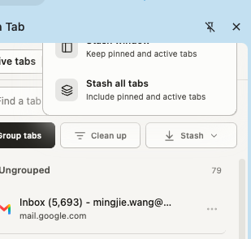

# Zen Tab

> 一个安静、快速且本地优先的浏览器标签工作区。

[English](README.md) · [简体中文](README.zh-CN.md)

Zen Tab 是一款面向重度标签用户的 Manifest V3 Chrome 扩展。它将 Chrome 原生侧边栏打造成一个专注、高效的指挥中心——帮助你轻松跨窗口查看标签、实时拦截与清理重复网页、高效整理归档书签，并支持把大型项目会话暂存以一键释放电脑内存，且所有操作完全不打乱你原有的浏览习惯。

---

## 产品预览

<p align="center">
  
</p>

---

## ✨ 核心能力与特性

### ⚡ 实时标签工作区
- **多窗口直观切换**：在侧边栏集中查看 Window 1、Window 2、Window 3，无需来回切换桌面窗口即可洞悉标签分布与数量。
- **Chrome 原生分组支持**：无缝对接 Chrome 原生标签组，支持在侧边栏中直接拖拽归类、折叠与颜色标记。
- **全局极速搜索（`⌘K` / `Ctrl+K`）**：支持对打开的标签、暂存会话与书签进行实时模糊搜索。

### 🛡️ 重复标签防护
- **及早感知拦截**：URL 一就绪即可秒级识别重复打开的网页。
- **安全可撤销**：一键关闭重复标签，并提供完整的 Undo（撤销）机制防误触。
- **隐私窗口隔离**：普通窗口与无痕/隐私窗口严格隔离，互不串联。

### 📦 会话暂存与恢复（Stash & Restore）
- **一键释放内存**：可暂存整个窗口、单个标签组或多选标签，并自动关闭页面，显著减轻内存占用。
- **随时在新窗口恢复**：需要重拾项目时，一键在全新窗口中完整还原工作现场。
- **零后台轮询**：采用纯事件驱动机制，大量标签常驻也丝毫不拖慢浏览器速度。

### 📥 书签收件箱与智能归档
- **视觉化文件夹胶囊**：以彩色药丸胶囊直观展示书签文件夹（如 `Work`、`Research`、`Reading` 等）。
- **随手归档 Inbox**：把临时研究的未归类标签快速拖拽收录至目标文件夹。
- **书签健康检查**：支持智能识别与清理冗余失效书签。

### 🎨 氛围画布与聚焦体验
- **动态氛围背景**：自适应的细腻动态纹理，伴随工作区状态带来沉浸而安静的视觉反馈。
- **高对比深浅色适配**：深色与浅色模式无缝切合，排版精致优雅。
- **键盘优先的多选操作**：全面支持 `Command/Ctrl + 点击`、`Shift + 点击` 以及 `Command/Ctrl + A` 快速多选。

---

## 🔒 隐私与安全承诺

Zen Tab 严格恪守本地优先（Local-First）原则：

- **100% 离线可用**：标签管理、重复检测、会话暂存均**无需联网**，不依赖任何外部服务器。
- **零数据上报与追踪**：不使用任何用户行为埋点、不收集浏览历史、绝无遥测统计。
- **安全防护兜底**：正在播放声音的媒体标签、固定标签（Pinned Tabs）与受保护系统页面绝不会被自动误关。
- **可选本地自备 Key AI**：高级语义分组为纯可选功能，仅在用户主动配置 Groq API Key（BYOK）后生效，密钥仅保存在本地 `chrome.storage.local` 中。

---

## ⌨️ 常用快捷键

| Mac 快捷键 | Windows / Linux 快捷键 | 功能 |
| :--- | :--- | :--- |
| `⌘ + Shift + Space` | `Ctrl + Shift + Space` | 快速展开 / 收起 Zen Tab 侧边栏 |
| `⌘ + K` | `Ctrl + K` | 聚焦全局模糊搜索框 |
| `⌘ + 点击` | `Ctrl + 点击` | 多选单个独立标签 |
| `Shift + 点击` | `Shift + 点击` | 连续区间选择多个标签 |
| `⌘ + A` | `Ctrl + A` | 选中当前分组/窗口内的全部标签 |

---

## 📦 安装方式

### 从 Chrome 网上应用店安装
> *目前正在 Chrome Web Store 审核中，官方审核通过后将在此更新一键安装链接。*

### 从源码加载（开发者模式）

1. **克隆代码库**：
   ```bash
   git clone https://github.com/wangm12/zen-tab.git
   cd zen-tab
   ```
2. **安装依赖并编译**：
   ```bash
   npm install
   npm run build
   ```
3. **在 Chrome 中加载**：
   - 打开 Chrome 浏览器，访问 `chrome://extensions`；
   - 开启右上角 **开发者模式（Developer mode）**；
   - 点击 **加载已解压的扩展程序（Load unpacked）**，选中 `zen-tab` 目录下的 `dist/` 文件夹；
   - 点击工具栏 Zen Tab 图标或按 `⌘ + Shift + Space`，即可开启侧边栏！

---

## 🛠️ 本地开发与质量保证

```bash
# 启动 Vite 本地热重载开发服务器
npm run dev

# 运行完整质量门禁检查（TypeScript + 350 个 Vitest 单元测试 + 打包验证）
npm run check

# 一键打包生成供 Chrome 商店上架的 zip 安装包
npm run package
```

---

## 🏗️ 技术架构

- **运行平台**：Chrome Extensions Manifest V3
- **前端技术栈**：React 18、TypeScript 5.7、Tailwind CSS 3.4
- **构建工具**：Vite 6、`@crxjs/vite-plugin`
- **自动化测试**：Vitest 2.1（350+ 单元测试覆盖）
- **状态管理**：Zustand 5 + Service Worker 统一事件总线
- **性能优化**：采用 `@tanstack/react-virtual` 虚拟列表，轻松支撑数百标签流畅滑动
