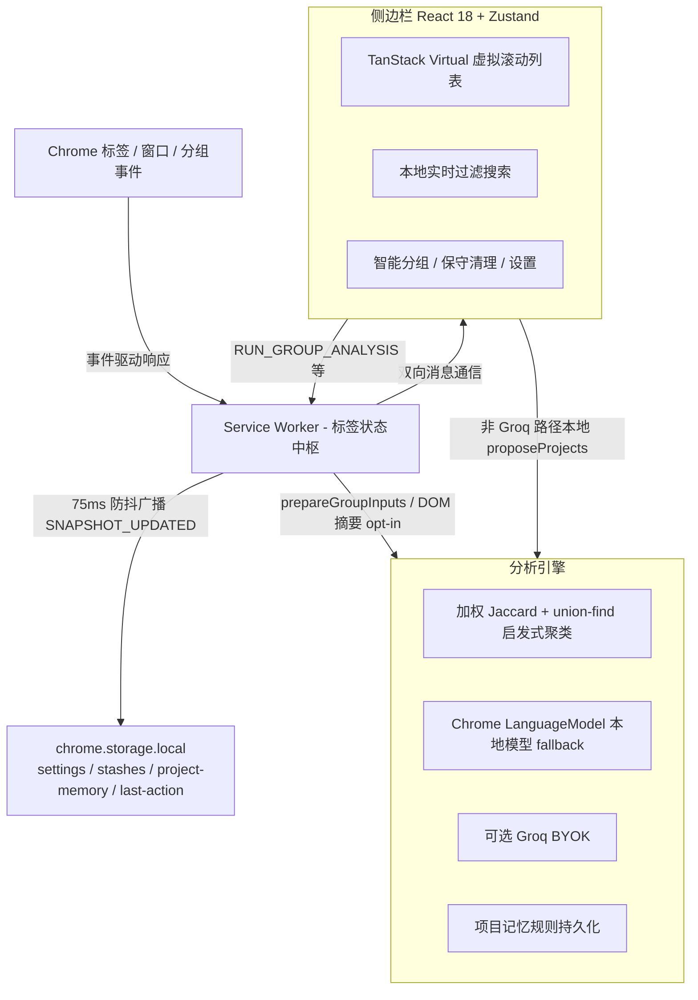
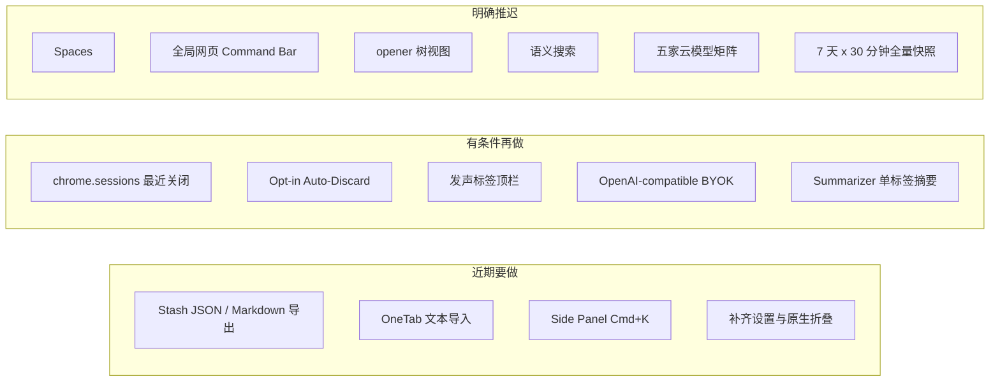
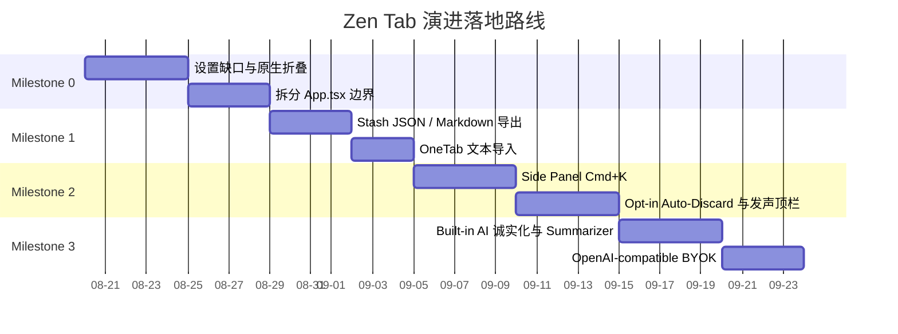

 # Zen Tab 深度 Review 与进阶路线图 (Review & Feature Roadmap)

> 本文档对 **Zen Tab** 的当前架构、已知缺口、同类竞品对比以及后续演进做系统梳理。
> 进阶功能分为：**近期要做**、**有条件再做**、**明确推迟**。不把愿景当成四周内必须交付的工程承诺。

---

## 目录

1. [项目定位与现状 Review](#一项目定位与现状-review)
2. [现有核心功能与优势清单](#二现有核心功能与优势清单)
3. [已知缺口（先于新功能）](#三已知缺口先于新功能)
4. [竞品对比与行业基准分析](#四竞品对比与行业基准分析)
5. [后续能力分层](#五后续能力分层)
   - [近期要做](#1-近期要做)
   - [有条件再做](#2-有条件再做)
   - [明确推迟](#3-明确推迟)
6. [分阶段落地演进路线 (Roadmap)](#六分阶段落地演进路线-roadmap)

---

## 一、项目定位与现状 Review

**Zen Tab** 是一款面向多标签页重度用户的 Manifest V3 Chrome 侧边栏工作区。核心设计理念是 **「克制、沉静、高性能与隐私优先」**：不接管浏览器、不采集完整浏览历史、AI 可关、低置信分组不强行合并、动作可审查可撤销。

### 关键架构特征

* **Service Worker 状态中枢**：内存中的 `tabIndex` / `groupIndex` 是标签真相源；侧边栏通过 `GET_SNAPSHOT` 与 `SNAPSHOT_UPDATED` 消费。写操作走 Mutation 队列（串行 Promise，保证顺序执行，**不是事务回滚**）。快照广播 75ms 防抖；去重检查另有 50ms 防抖。无常驻轮询。
* **极速虚拟化渲染**：前端使用 `@tanstack/react-virtual` 渲染标签列表。组件名 `TabTree` 是分组 + 扁平列表，**不是** `openerTabId` 树。
* **本地优先与隐私安全**：核心管理 100% 离线可用；无 content script；页面摘要仅在用户开启 deep scan 且授予 `scripting` + `<all_urls>` 后注入。暂存、设置、项目记忆存在 `chrome.storage.local`；Groq API Key 仅本地保存。
* **Built-in AI 已接线**：`createAIProvider` 的顺序是 Groq（若选中且有 key）→ Chrome `LanguageModel` / 旧 `ai.languageModel` → 启发式。后续工作是补齐 availability / 下载进度 / 诚实失败提示，而不是从零接入。

---

## 二、现有核心功能与优势清单

| 核心模块 | 现有功能与实现亮点 | 对应关键代码 |
| :--- | :--- | :--- |
| **侧边栏全景工作区 (Live Workspace)** | • 多窗口切换与无痕模式隔离 • 原生 Tab Group：重命名、9 色调色板、解散；侧边栏可折叠**列表视图**（尚未调用 `chrome.tabGroups.update({ collapsed })` 同步原生折叠） • 拖拽排序（移到开头、跨标签插入、拖入分组、拖到暂存库） • 键盘多选（`⌘/Ctrl + 点击`、`Shift + 范围点击`、`⌘/Ctrl + A`） • 快捷标签控制（激活、手动 Discard、静音、固定、关闭） | [`src/sidepanel/App.tsx`](../../src/sidepanel/App.tsx) |
| **重复标签实时防护 (Duplicate Guard)** | • 本地 URL 规范化：剥离 UTM / 跟踪参数 / hash / 尾斜杠（**不是**抓取页面 HTTP Link canonical） • 跨窗口或同窗口查重范围自选 • 不干扰固定标签、`chrome://` 等特殊页；无痕默认不参与（`incognitoEnabled` 字段存在，设置页暂无开关） • 关闭新标签并聚焦已有标签，写一条 30s TTL 的撤销日志；侧边栏 `⌘Z` 可撤销 | [`src/background/service-worker.ts`](../../src/background/service-worker.ts) [`src/shared/url.ts`](../../src/shared/url.ts) |
| **项目级智能分组 (Project AI Grouping)** | • **多层分析**：加权 token Jaccard 聚类（title×3 / summary×2 / url×1，阈值 0.26，**不是 TF-IDF**）→ 可选 Chrome Built-in AI → 可选 Groq BYOK • 深度页面摘要为 opt-in（最多自适应 32 页，或 deep scan 全量，每页 ≤900 字） • **克制建议制**：High / Medium / Low 置信度与 Evidence；启发式直接丢弃 Low；不强行合并弱信号 • **项目记忆**：用户采纳后写入本地规则，下次分析时加权；无痕窗口不学习 • 审查弹窗：组间微调、排除未分类、再应用 | [`src/shared/ai.ts`](../../src/shared/ai.ts) [`src/sidepanel/App.tsx`](../../src/sidepanel/App.tsx) |
| **保守型清理扫描 (Safe Cleanup)** | • 识别重复搜索结果页、OAuth / redirect 中间页等低价值标签 • **硬保护**：活跃、固定、音频播放中、特殊 URL、localhost / `*.local`、受保护域名（Figma / Docs / Notion / Slack 等） • 可选页面体检（脏表单、编辑器、播放中媒体）；拿不到脚本权限则 fail-closed | [`src/shared/ai.ts`](../../src/shared/ai.ts) [`src/background/service-worker.ts`](../../src/background/service-worker.ts) |
| **会话暂存库 (Stash & Restore)** | • 整窗口、单分组、自定义多选一键暂存并关闭原标签（上限 50 条） • 会话重命名与本地全文检索 • **细粒度恢复**：新窗口恢复整套，或单独恢复某个分组 / 单条标签 | [`src/sidepanel/App.tsx`](../../src/sidepanel/App.tsx) [`src/shared/storage.ts`](../../src/shared/storage.ts) |
| **撤销 (Action Journal)** | • 可撤销：去重关闭、应用分组、分组改名/改色/解散、清理关闭、暂存 • 不可撤销：拖拽移动、静音/固定/Discard、删除 stash、改设置 • **只有一条** `zen-tab.last-action`，TTL 30s；Toast 展示 5s | [`src/background/service-worker.ts`](../../src/background/service-worker.ts) |
| **双语与主题 (i18n & Themes)** | • English / 简体中文；跟随系统 / 浅色 / 深色 | [`src/sidepanel/i18n.ts`](../../src/sidepanel/i18n.ts) |

---

## 三、已知缺口（先于新功能）

这些会直接拖累后续 milestone，应作为 **Milestone 0** 处理，而不是和新功能混在一起。

* **设置页不完整**：`ignoredDomains`、`incognitoEnabled` 已入库但无 UI；`groqModel` 不能选。
* **分组折叠不同步原生 Chrome**：侧边栏 `collapsed` Set 只藏列表行。
* **`App.tsx` 过重**：工作区 / 分组弹窗 / 清理 / Stash / 设置约 900 行同文件。再加命令面板或导入导出前，至少把 Stash / Settings / Tab 列表拆开。
* **`summarizeTabs()` 是空实现**：恒返回 `[]`；真正的 DOM 摘要在 Service Worker 的 `executeScript` 里。
* **测试面窄**：Vitest 覆盖 url / ai / storage，没有 Service Worker 与 UI 测试。
* **权限面仍很克制**：无 `content_scripts`、无 `chrome.commands`、无 `alarms`。新调度或全局快捷键都要先写清权限理由。

---

## 四、竞品对比与行业基准分析

| 竞品名称 | 核心主打优势 | 竞品痛点 / 不足 | Zen Tab 对比 |
| :--- | :--- | :--- | :--- |
| **Arc Browser (Tidy Tabs & Spaces)** | 侧边栏美学、AI 整理、Spaces | 必须换浏览器；产品线已转向 Dia | 在 Chrome 里提供可审查、可撤销的分组，而不是复制 Spaces |
| **OneTab** | 一键收拢标签、释放内存 | UI 老、丢失 Tab Group 结构、恢复粗糙 | 结构化保留分组与状态；应用 OneTab 文本导入作为迁移入口，而不是做成 OneTab |
| **Session Buddy** | 历史会话备份与崩溃恢复 | 偏被动记录，缺少主动整理与去重 | 主动去重 / 分组 / 清理；崩溃恢复优先用 `chrome.sessions`，不先做全量滚动快照 |
| **Workona / Toby** | 团队 Workspace、云同步 | 账号、收费、数据出域 | 坚持 Local-First；不做云同步 |
| **Tabox / Smart Tab Organiser** | 导入导出、自定义云模型 Key | 缺少常驻虚拟化侧边栏与项目记忆 | 侧边栏体验 + 本地项目记忆；BYOK 走 OpenAI-compatible，而不是供应商目录 |
| **Auto Tab Discard** | 后台休眠 | 功能单一；「节省 80% 内存」是营销口径 | 手动 Discard 已有；自动休眠必须 opt-in，且复用清理白名单。Chrome 自身已有 Memory Saver |

Zen Tab 的差异化应继续落在：**本地、克制、可审查、可撤销的侧边栏工作区**。不要用 Spaces、全局注入、语义搜索去追 Arc / Workona。

---

## 五、后续能力分层

### 1. 近期要做

* **Stash 导出**
  * **JSON**：完整保留分组名、颜色、折叠状态、pin / mute、创建时间，便于换机与备份。
  * **Markdown**：带分组层级的链接清单，可粘贴到 Notion / Obsidian / Logseq。
* **OneTab 文本导入**：解析纯文本 URL 列表，作为老用户迁移入口。导入后进入 Stash，而不是立刻在浏览器里打开全部标签。
* **侧边栏 `Cmd+K`**：仅在 Side Panel 内。命令示例：暂存当前窗口、运行清理、打开设置、聚焦搜索、切换窗口。复用现有本地过滤，不引入 embedding。
* **设置与原生折叠**：补 `ignoredDomains` / 无痕开关；分组折叠同步 `chrome.tabGroups.update({ collapsed })`。

### 2. 有条件再做

设计必须服从 MV3 与现有隐私承诺。

* **会话恢复，而不是滚动快照**
  * 优先评估 `chrome.sessions`（最近关闭的窗口 / 标签）。
  * 可另做「导出当前窗口为 JSON」作为手动备份。
  * **不要**默认每 30 分钟写一份全量快照保留 7 天：SW 不能靠 `setInterval`；需要 `chrome.alarms`；336 份全量快照很容易打穿 `chrome.storage.local` 默认 10MB。
* **Opt-in Auto-Discard**
  * 用 `chrome.alarms` 唤醒，持久化空闲判断，**禁止**在 Service Worker 里挂长生命周期 `setTimeout`。
  * 默认关闭。排除条件复用清理保护：活跃、固定、发声、受保护域名、特殊 URL。
  * 脏表单检测需要 `scripting`，必须与 deep scan 一样 opt-in。
  * 不承诺「降低 60%–80% 内存」；Chrome Memory Saver 已存在。
* **发声标签顶栏**：`audible` 与 per-tab mute 已有，做一条可跳转 / 可静音的顶栏即可，不单独开支柱。
* **Built-in AI 补齐**：`LanguageModel.availability()`、模型下载进度、不可用时回退启发式。本地推理跑在侧边栏（Prompt API 在 worker 中不可靠），不要改回 SW。
* **单标签 TL;DR**：优先 Chrome `Summarizer`（任务型 API，比通用 Prompt 更合适），opt-in，结果可关掉。
* **一个 OpenAI-compatible BYOK**：`base URL + API key + model`，覆盖 Groq / OpenAI / 本地 Ollama。不在设置里做五家品牌开关。Anthropic 协议不同，除非有明确需求否则不做。

### 3. 明确推迟

与「克制 / 本地优先 / 无网页注入」冲突，或与现有窗口 + 分组 + Stash 重叠。

| 项目 | 推迟原因 |
| :--- | :--- |
| **Spaces** | Chrome 没有原生 Space。窗口 + Tab Group + Stash 已覆盖换上下文。再做隐藏/隔离是第三套信息架构。 |
| **全局网页 Command Bar** | 任意页面浮层需要 `content_scripts` + `<all_urls>`，CWS 与隐私模型从「侧边栏工具」变成「注入所有网页」。`chrome.commands` 只能绑快捷键，画不出 Raycast 浮层。 |
| **opener 树视图** | `openerTabId` 在恢复、Discard、部分导航后经常丢失；虚拟列表 + 树会显著增加 `TabTree` 复杂度。 |
| **自然语言语义搜索**（如「上周看的 Rust 文章」） | 需要时间索引与 embedding；当前明确不采集完整浏览历史；打开标签上的 `lastAccessed` 不够支撑「上周」。 |
| **五家云模型矩阵** | 设置页会变成供应商目录；OpenAI-compatible 一个入口就够。 |
| **7 天 × 30 分钟全量滚动快照** | 存储配额、权限与「Chrome 已会恢复会话」三重不划算。 |
| **云同步 / 账号** | 直接放弃相对 Workona 的差异化。 |

---

## 六、分阶段落地演进路线 (Roadmap)

时间按相对顺序，不绑死日历。每一期都应能独立发布，并继续通过 `npm run check`。

### Milestone 0：把现有产品做完整

在加新能力之前关闭已知缺口。

* 修正设置：`ignoredDomains`、无痕开关；分组折叠同步原生 Tab Group。
* 拆分 [`src/sidepanel/App.tsx`](../../src/sidepanel/App.tsx)：至少 Stash / Settings / 标签列表分开，避免下一阶段无法改。
* 文档与实现保持一致：聚类算法、debounce 范围、Built-in AI 已存在、撤销只有一条。

**完成标准**：设置页能管理去重忽略域与无痕；点击分组折叠会反映到 Chrome 原生分组；侧边栏主文件不再承担全部弹窗与列表。

### Milestone 1：数据可以离开浏览器

* Stash 导出 JSON（完整元数据）与 Markdown。
* OneTab 纯文本导入 → 写入 Stash，带校验与上限（现有 50 条）。
* 可选：一键导出当前窗口。崩溃恢复若做，先接 `chrome.sessions` 最近关闭，不做滚动全量快照。

**完成标准**：用户能把现有 Stash 备份到文件，也能从 OneTab 导出文本迁入；不申请 `unlimitedStorage`，除非有实测配额数据。

### Milestone 2：侧边栏效率

* Side Panel 内 `Cmd+K` 命令面板 + 现有本地搜索。无网页注入。若需要全局唤起侧边栏，只用 `chrome.commands` 打开 panel，不画页面浮层。
* Opt-in Auto-Discard：`alarms` 权限、默认关、复用 cleanup 保护域。
* 发声标签顶栏：跳转 / 静音，复用已有 `audible` 状态。

**完成标准**：键盘用户可不靠鼠标完成暂存、清理、切窗口；自动休眠默认关且可从设置关闭；未增加 content script。

### Milestone 3：把已有 AI 做诚实

* Built-in AI：availability、下载、失败回退启发式（路径已存在）。
* 单标签摘要走 `Summarizer`，opt-in。
* 一个 OpenAI-compatible provider（可替换或扩展当前 Groq）。语义搜索不做。

**完成标准**：无本地模型 / 无 Key 时，分组仍然可用（启发式）；设置里只有「本地自动 / OpenAI-compatible」，而不是五家模型商标。

### 非目标（本路线图周期内不做）

* Spaces、全局 Command Bar、opener 树、语义搜索、多品牌云模型、云同步、7 天滚动全量快照。
